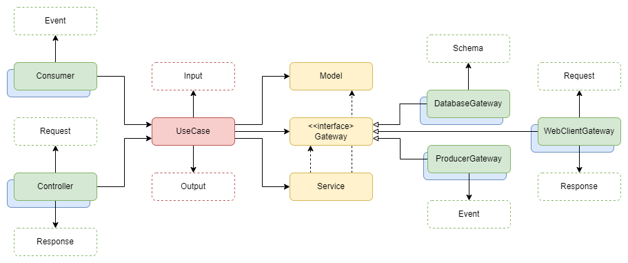
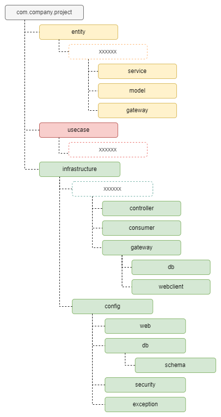

Arquitetura Limpa para Aplicações com Spring
===

Em resumo, a Arquitetura Limpa propõe mecanismos e ferramentas para que desenvolvedores construam `softwares` que sejam manutenível e expansíveis. Essa característica é alcançada ao tornar códigos de regra de negócio mais abstratos, com responsabilidades bem definidas e independentes de códigos de infraestrutura.

Alcançar o Estado da Arte da `Arquitetura Limpa` pode ser trabalhoso, algo caro para se construir e manter, e em tem casos isso não vale a pena. 
Por isso, há um capítulo onde o autor fala sobre Limites Parciais, que explica que alguns limites arquiteturais podem ser quebrados dependendo da análise de quem está arquitetando o software.
Ele pode decidir manter ou não algum limite arquitetural.

Atualmente, para a maioria dos projetos comerciais, é inviável construir um `software` sem utilizar algum framework. Eles resolvem muitos problemas e aceleram o ciclo de desenvolvimento. Ao mesmo tempo, eles podem ser muito invasivos e acabar sujando seu código, criando um acoplamento muito forte e tornando seu código refém dele.

Arquitetura Limpa e Framework
===

É muito comum, por exemplo, utilizar `Spring Framework` com `Java/Kotlin` para o desenvolvimento de aplicações comerciais. Ferramentas como `Spring Boot`, `Spring MVC` e `Spring Data` salvam a vida de muitos desenvolvedores todos os dias.

>Como ter uma Arquitetura Limpa trabalhando junto com o Framework?

O diagrama a seguir mostra uma forma de conciliar o isolamento das regras de negócio e a utilização de frameworks para construir aplicações comerciais. A regra da dependência pode ser quebrada entre as camadas de `frameworks (azul)` e `adapters (verde)`, pois nessas camadas não irão existir códigos de negócios. Para as camadas de `Use Case (vermelho)` e `Entity (amarelo)`, deve-se manter a regra da dependência para isolá-las, já que são responsáveis pelo real funcionamento da aplicação.

>Nota-se que não existem setas que saem de uma Entity para apontar para qualquer outro componente e que as setas que saem do Use Case só apontam para Entities.

Isso garante que o coração da aplicação não dependa da infraestrutura que o sustenta.

Pacotes 
===

Para a organização de pacotes, tem-se a seguinte proposta. 
Nota-se como cada camada da Arquitetura Limpa estão separadas em três pacotes base: `Entity`, `Use Case` e `Infrastructure` (frameworks e adapters).
Como cada conjunto de componentes (`services`, `gateway`, `model`) estão agrupados por domínio (xxxxx).

